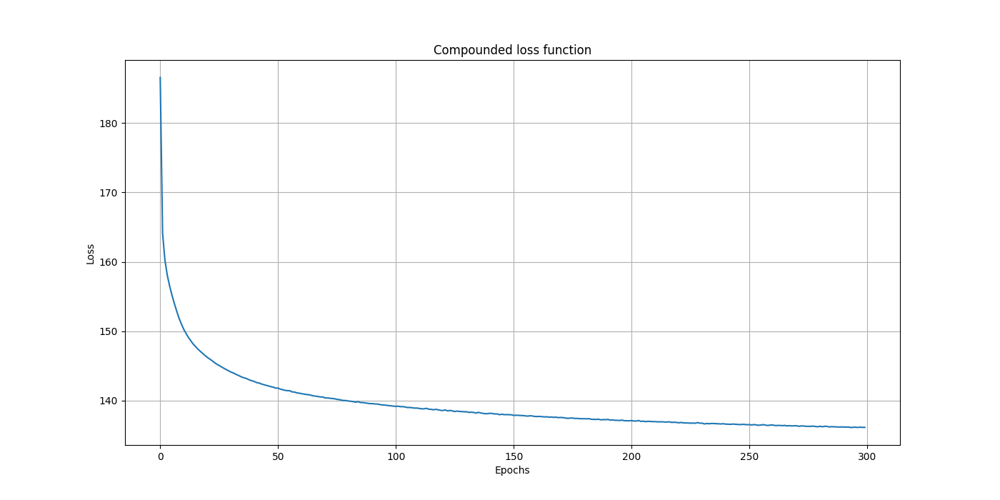
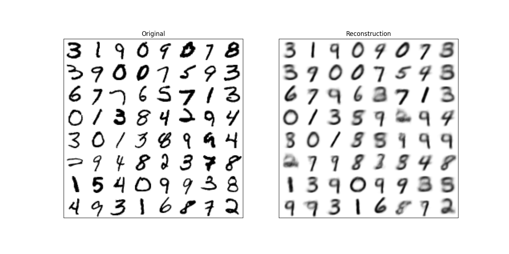
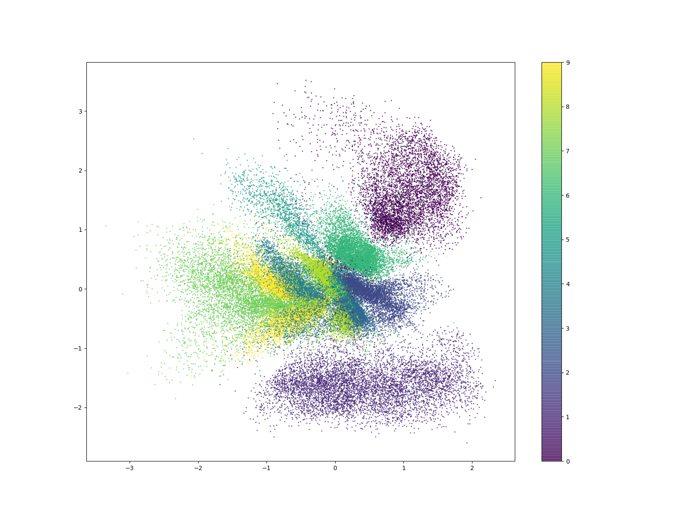
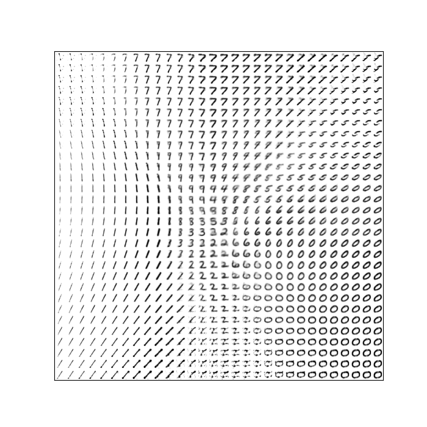

# Variational AutoEncoders (VAE)
This repository contains a **minimal implementation of a VAE**. The original
formulation has been used, without any modification.

## Results
The algorithm has been trained taking as an example the MNIST dataset. The network
has been trained during 300 full epochs and no weighting has been applied to the
two loss components. A latent space with 2 dimensions has been chosen in order to be able to plot it. Below, the training loss epoch by epoch.

At this level, the reconstructed images look as follows.

Let's see how the latent space looks like. For that, the full MNIST dataset has been encoded into the latent space and a scatter plot has been generated. Each of the dots has been colored depending on their label.

Finally, a `linspace` grid has been generated, covering the two latent dimensions from -3 to 3 in each of them. Next, each of them has been reconstructed using the decoder. The generations achieved, representing digits which don't exist in the original data set, are shown below.

## Getting started
If you want to use my code or reproduce the experiments, I recommend you following the next steps.

1. Install [pyenv](https://github.com/pyenv/pyenv) and [poetry](https://python-poetry.org/) in your system following the linked official guides.
2. Open a terminal, clone this repository and `cd` into the folder.
3. Run `pyenv install 3.7.3` in your terminal for installing the required python.
   version
4. Configure poetry with `poetry config virtualenvs.in-project true`
5. Create the virtual environment with `poetry install`
6. Activate the environment with `source .venv/bin/activate`
7. Try the algorithm with the default parameters `python main.py`

If everything goes well, a VAE will be trained during 300 epochs, and the images will be generated into the `img`
folder.

## References
[**An Introduction to Variational Autoencoders**](https://arxiv.org/abs/1906.02691), *Diederik P. Kingma, Max Welling*, Foundations and Trends in Machine Learning
## Contribution
If you are willing to contribute to this repository, please feel free to issue a pull request. Keep in mind that the intention of it is to be as simple as possible. If you want to correct a potential bug or propose some modification, try to make it as simple and clean as possible.

## License
This repository is licensed under MIT license. More info in the LICENSE file. Copyright (c) 2020 Iván Vallés Pérez
